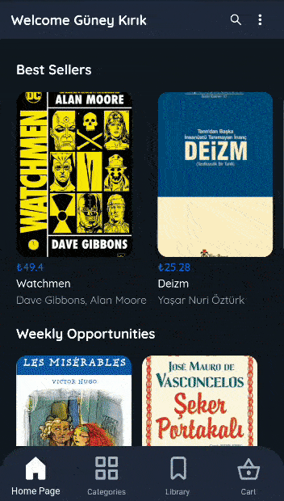

# Patates Bookstore

Patates is an online book buying application.  
To see gifs of application, go to bottom of the page. 

### Requirements

An Android phone or emulator.

### Setup

Download and install Patates Apk from this [link](https://drive.google.com/open?id=1S0FIYmZkfV5akQSCpgjLK2_FFdgaZQoZ).

## Technology Used

* [Flutter](https://flutter.dev/) - A framework that enabled us to develop cross_platform mobile app.
* [Firebase](https://firebase.google.com/) - Google's mobile platform that helps you quickly develop high-quality apps and grow your business.
* [Spring Boot](https://spring.io/projects/spring-boot) - An open source Java-based framework used to create a micro Service.
* [Elasticsearch](https://www.elastic.co/) - RESTful search and analytics engine capable of addressing a growing number of use cases.
* [Swagger](https://swagger.io/) - Swagger UI allows development team to visualize and interact with the API's resources without having any of the implementation logic in place.
* [Heroku](https://www.heroku.com/) - Heroku is a platform as a service (PaaS) that enables developers to build, run, and operate applications entirely in the cloud. We used it for Spring Boot deployment.
* [Bonsai.io](https://bonsai.io/) - Bonsai.io is a platform as a service (PaaS) that enables developers to build a elasticsearch application in the cloud.

## Gifs of Application

<table>
<tr>
  <td>Admin Panel</td>
  <td>Give Order</td>
  <td>Make Comment</td>

</tr>
<tr>
  <td>
    
  </td>
  <td>
    
  </td>
  <td>
    
 </td>
  </tr>
  
</tr>
</table>
<table>

  <tr>
  <td>Compare Book</td>
  <td>List Books</td>
</tr>
  <tr>
    <td>
  </td>  
  <td>
 </td>
 

</tr>
</table>

## Contributors

* **Güney Kırık(Software Tester)** - [LinkedIn](https://www.linkedin.com/in/guneykirik/)
* **Mehmet Akif Baysal(Software Configuration Manager)** - [LinkedIn](https://www.linkedin.com/in/play0sm/)
* **İrem Dereli(Software Project Manager)** -  [LinkedIn](https://www.linkedin.com/in/iremdereli/)
* **İlkan Akın Erenler(Software Analyst)** -  [LinkedIn](https://www.linkedin.com/in/ilkanakin/)
* **Mehmet Sezer(Software Architect)** - [LinkedIn](https://www.linkedin.com/in/mehmetsezerr/)

